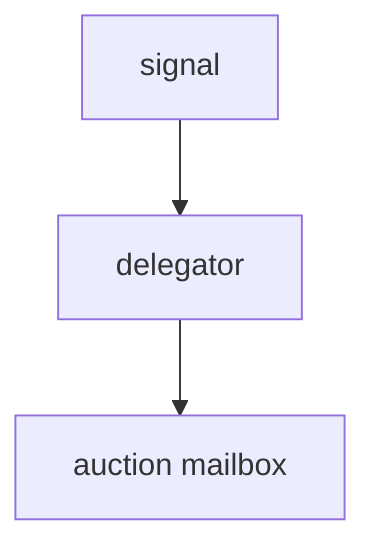
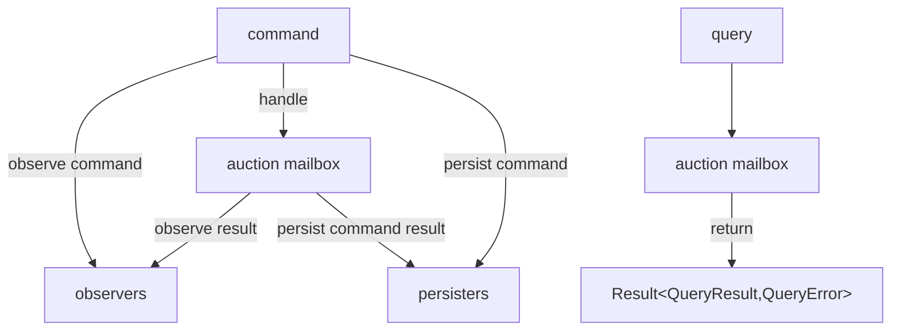

# auctions-site [](https://ci.appveyor.com/project/wallymathieu/auctions-site/branch/master)

Auctions site implemented in f# with f#+, Redis, Fleece and Suave

## Technical overview

### Assumptions

- each auction get 1 mailbox
- all commands (once they are authorized) are logged in redis, json et.c. (even commands that are rejected)
- one dedicated mailbox for command persisters (json, redis)
- exceptions in mailbox causes the entire program to exit with non zero exit code

### High level overview of command and query flow





### Cloud and architecture

Would this type of solution work in a cloud deployment? You would either have few enough auctions and bidders that you can have a single compute instance (such as AWS App Runner instance or Azure App Service or whatnot). This assumption can be OK for a small business.

The reason why I wanted a single mailbox per auction was a reaction to the classic load, execute and store (load data from the database, execute business logic and store the result). If you use a SQL database you want to do a row-version checking scheme in order to avoid two threads mutating data in ways that will be inconsistent (say two bids being accepted with the same amount, or a higher bid being accepted while a lower bid coming after that bid also gets accepted). You want to be able to have single threaded behaviour. The idea of using a single thread or actor per auction follows naturally.

If the system have mechanisms against bid sniping and there are few enough people bidding, then the probability of bids arriving sufficiently close in time could be small enough.

## Business requirements

A more complete implementation could have more logic dealing with the business side of running the application. Right now the code does not match a full list of requirements that you would find for implementing a real auction engine.

Potential requirements are:

- "Bid robot": Whenever someone else puts a bid, you specify that the robot puts a bid with an amount above that bid until your maximum price has been reached.
- Possibility to get notifications when an auction is over if you have created the auction or posted a bid.
- Integration with payment system in order to be able to process payment after an auction has been won. Then the question if the auction service should be "told" about won but abandoned auctions.
- Reports with aggregated information about the auctions per week, per month and per year.
- That the system extends an auction if someone bids very close to the end of the auction in order avoid bid sniping.
- That the system does not reject low bids but rather tell the bidder that there is someone else with a higher bid. You register bid intent rather than successfull bid.
- Mechanism to allow the winner to drop out and let the next highest bid win.

Since the service provide web hooks you could implement some of these requirements in separate services. In other cases people might argue that auction notifications and bid robots are part of the auction subdomain so should be part of the bounded context (i.e. the responsibility of the service).

## Running it

If you run the project without any parameters, auctions will be in memory only. In order to persist commands you will need to provide either a
connection string to redis or file to persist commands in.

```bash
dotnet restore
dotnet run --project App --redis CONN --json FILE --web-hook URI
```

To try out the auction API you can then curl the service:

```bash
AUCTIONS_TOKEN_SELLER=`echo '{"sub":"a1", "name":"Seller", "u_typ":"0"}' | base64`
# eyJzdWIiOiJhMSIsICJuYW1lIjoiU2VsbGVyIiwgInVfdHlwIjoiMCJ9Cg==
AUCTIONS_TOKEN_BUYER=`echo '{"sub":"a2", "name":"Buyer", "u_typ":"0"}' | base64`
# eyJzdWIiOiJhMiIsICJuYW1lIjoiQnV5ZXIiLCAidV90eXAiOiIwIn0K
curl  -X POST -d '{ "id":1,"startsAt":"2018-01-01T10:00:00.000Z","endsAt":"2019-01-01T10:00:00.000Z","title":"First auction", "currency":"VAC" }' -H "x-jwt-payload: $AUCTIONS_TOKEN_SELLER"  -H "Content-Type: application/json"  127.0.0.1:8083/auction
curl  -X POST -d '{ "amount":"VAC10" }' -H "x-jwt-payload: $AUCTIONS_TOKEN_BUYER"  -H "Content-Type: application/json"  127.0.0.1:8083/auction/1/bid
curl  -X GET -H "x-jwt-payload: $AUCTIONS_TOKEN_SELLER"  -H "Content-Type: application/json"  127.0.0.1:8083/auctions
```

